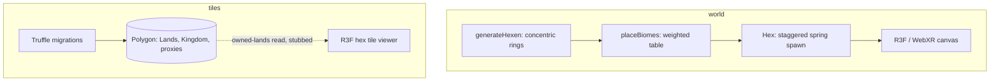
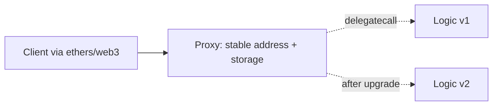

# Shattered Lands

An experimental WebXR MMO demo: on-chain land ownership plus a procedural 3D world you can walk in the browser.

## Why it exists

I built Shattered Lands at Mayland Labs between 2021 and 2023, betting that a browser MMO could put land ownership on-chain and still play like a game. It was funded by Polygon and Vchain, reached the Metathon finals, and got into incubation at Sparklab and Draper University. This repo is the demo side of that work, the procedural world plus the land-ownership contracts and viewer. It is the very early prototype; I later rebuilt the production version on Wonderland Engine, a WebXR engine.

The world generator is live at [shattered-world-intp.vercel.app](https://shattered-world-intp.vercel.app).

## What it does

- Generates a hex-grid world of biomes procedurally, in concentric rings around a spawn
- Renders it in WebXR with React Three Fiber, so it runs on a headset or a plain browser
- Models land as on-chain NFTs, deployed to Polygon with an upgradeable contract setup
- Ships a 3D hex tile viewer for selecting and inspecting land tiles

## How it works

The repo is two subsystems. `world/` is the procedural generator and XR client. `tiles/` is the land-ownership layer: Truffle migrations that deploy to Polygon, the contract ABIs, and a React Three Fiber hex viewer.



### The procedural hex-world generator

`generateHexen` lays out the map as concentric hexagonal rings from a center tile. It walks each ring's perimeter with a fixed six-segment step matrix (`xMatrix` and `zMatrix`, tile diameter 20). `placeBiomes` then rolls `Math.random()` against a weighted table: shardium 0.01, iron 0.05, mountain 0.15, plateau 0.35, plain 0.65, forest as the fallback. The center is reserved for the spawn building, and the first ring is forced to plains. That keeps rare resource biomes rare and the ground near spawn walkable. Each tile animates up from y = -100 with react-spring on a staggered delay of `(6 * ring) + index`, so the world grows outward ring by ring.

### On-chain land ownership

The `tiles/` migrations deploy an ERC721 `Lands` contract and a `Kingdom` contract. `Box` and `Achievements` go out through OpenZeppelin's `deployProxy`, so they sit behind upgradeable proxies. The game logic can ship a new version without moving the ownership records underneath it. `truffle-config.js` points the deploy at Polygon Mumbai over a Chainstack websocket through an HDWalletProvider. Migration 1 writes the deployed `Lands` and `Kingdom` addresses to a JSON file for the client.



One caveat: the repo has the compiled ABIs (`Lands`, `Kingdom`, `Achievements`, the `Shardium` ERC20, `Mine`, `Building`, `Box`/`BoxV2`) and the migration scripts. The Solidity sources live elsewhere, and the client's ethers/web3 read of owned lands is scaffolded but commented out.

### Free variety from hex symmetry

Each tile spawns with a random rotation, always a multiple of 60 degrees. A hexagon has six-fold symmetry, so any of those orientations still locks into the grid cleanly. It breaks up the visual repetition of the reused chunk models. Higher biomes like mountains, plateaus, and crystal also get a small random height bump, so those areas rise above the plains.

## Tech stack

- Frontend: React 17, Three.js, React Three Fiber, drei, react-spring, gsap, @react-three/xr
- Chain: Truffle, Solidity 0.8.10, OpenZeppelin upgradeable proxies, ethers, web3, Polygon Mumbai
- Tooling: Create React App, HDWalletProvider, Chainstack RPC

## Repo layout

```
shattered-lands/
  world/    procedural hex-grid biome generator + WebXR client (live on Vercel)
  tiles/    NFT land ownership (Truffle migrations + ABIs) and a 3D tile viewer
```

## Running it

```bash
# world generator / XR client
cd world
npm install
npm start        # http://localhost:3000

# tile viewer
cd tiles
npm install
npm start
npm run deploy   # truffle migrate to Polygon Mumbai
```

The deploy reads a wallet key from `tiles/.secret`. The committed value is a dummy placeholder, so supply your own to deploy to a live network.

## Status

Experimental demo, built at Mayland Labs from 2021 to 2023. The world generator is live. The contract side is a deployment record and viewer, prototype code that was never audited.
