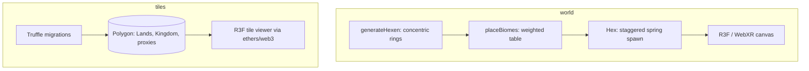

# Shattered Lands

An experimental WebXR MMO demo: on-chain land ownership plus a procedural 3D world you can walk in the browser.

## Why it exists

I built Shattered Lands at Mayland Labs between 2021 and 2023. The bet was that a browser MMO could put land ownership on-chain and still feel like a game rather than a wallet. It was funded by Polygon and Vchain, reached the Metathon finals, and was admitted to incubation at Sparklab and Draper University. This repo is the demo side of that work: the procedural world and the land-ownership contracts and viewer.

The world generator is live at [shattered-world-intp.vercel.app](https://shattered-world-intp.vercel.app).

## What it does

- Generates a hex-grid world of biomes procedurally, in concentric rings around a spawn
- Renders it in WebXR with React Three Fiber, so it runs on a headset or a plain browser
- Models land as on-chain NFTs, deployed to Polygon with an upgradeable contract setup
- Ships a 3D tile viewer that reads the deployed contract addresses and shows owned tiles

## How it works

The repo is two subsystems. `world/` is the procedural generator and XR client. `tiles/` is the land-ownership layer: Truffle migrations that deploy to Polygon, the contract ABIs, and a React Three Fiber viewer that talks to them through ethers and web3.



### The procedural hex-world generator

`generateHexen` lays out the map as concentric hexagonal rings from a center tile. Instead of computing axial coordinates, it walks each ring's perimeter by adding a fixed six-segment step matrix (`xMatrix` and `zMatrix` over a tile diameter of 20), which keeps the ring math to plain additions. `placeBiomes` then rolls `Math.random()` against a weighted table (shardium 0.01, iron 0.05, mountain 0.15, plateau 0.35, plain 0.65, forest as the fallback), with the center reserved for the spawn building and the first ring forced to plains, so rare resource biomes stay rare and the ground around spawn stays walkable. Each tile then animates up from y = -100 with react-spring on a staggered delay of `(6 * ring) + index`, so the world grows outward ring by ring instead of popping in all at once.

### On-chain land ownership

The `tiles/` migrations deploy an ERC721 `Lands` contract and a `Kingdom` contract, and use OpenZeppelin's `deployProxy` for the `Box` and `Achievements` contracts, so those sit behind upgradeable proxies. That means the game logic can ship a new version without moving the ownership records underneath it, which matters when land is the thing people paid for. `truffle-config.js` points the deploy at Polygon Mumbai over a Chainstack websocket through an HDWalletProvider, and migration 1 writes the deployed `Lands` and `Kingdom` addresses to a JSON file the client reads. Worth being honest here: the repo carries the compiled ABIs (`Lands`, `Kingdom`, `Achievements`, the `Shardium` ERC20, `Mine`, `Building`, `Box`/`BoxV2`) and the migration scripts, so it documents the deployment and the client wiring rather than the Solidity sources themselves.

## Tech stack

- Frontend: React 17, Three.js, React Three Fiber, drei, react-spring, gsap, @react-three/xr
- Chain: Truffle, Solidity 0.8.10, OpenZeppelin upgradeable proxies, ethers, web3, Polygon Mumbai
- Tooling: Create React App, HDWalletProvider, Chainstack RPC

## Repo layout

```
shattered-lands/
  world/    procedural hex-grid biome generator + WebXR client (live on Vercel)
  tiles/    NFT land ownership (Truffle migrations + ABIs) and a 3D tile viewer
```

## Running it

```bash
# world generator / XR client
cd world
npm install
npm start        # http://localhost:3000

# tile viewer
cd tiles
npm install
npm start
npm run deploy   # truffle migrate to Polygon Mumbai
```

The deploy reads a wallet key from `tiles/.secret`. The value committed here is inert (a 65-char hex string, not a valid seed), carried over from the original repo, so supply your own to deploy.

## Status

Experimental demo, 2021 to 2023, consolidated from the `shatteredTiles` and `shatteredWorld` repos with history preserved. The world generator is live; the contract side is a deployment record and viewer, not audited production code.
